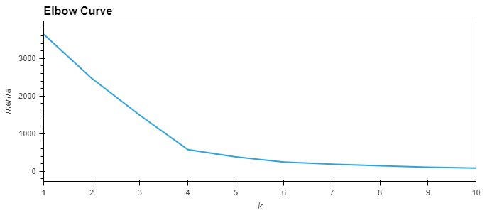
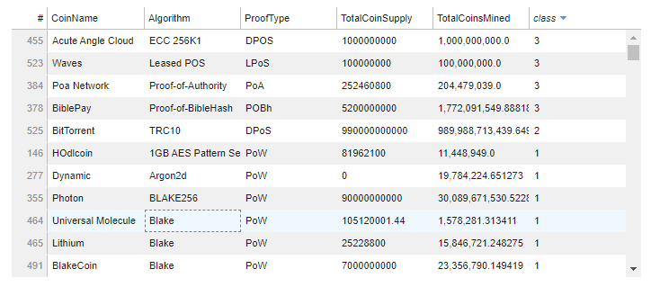
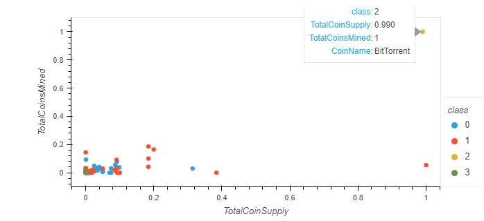

# Cryptocurrencies

## Overview:
The project delivered 4 technical analysises.  

- Deliverable 1 & 2: Preprocessing the Data for PCA, Reducing Data Dimensions Using PCA

  * Principal component analysis (PCA) is used to limit features and speed up the model. We want the data to be transformed graphed as to be a best-fitting line that is defined as one that minimizes the average squared distance from the points to the line.

- Deliverable 3: Clustering Cryptocurrencies Using K-means

  * K-Means is the algorithm to group data into K clusters, data is clustered based on some similarity or distance to a centroid.

  * The Elbow Curve is used to determine the best value for K.

- Deliverable 4: Visualizing Cryptocurrencies Results

hvplot table and scatterplots are used to show the visuals.

  
## Results:

Determined the Best K value is 4 based on the "elbow".

Class 3 values use Algorithms that are not commonly used in other Cryptos.

The majority of the cryptocurrencies are clustered in the lower left.

## Summary:

The data in the 3D graphs and the charts are clustered mostly in the bottom left.   An interesting addition to the dataset would be kilowatt/hour costs (assuming it could be made available).

